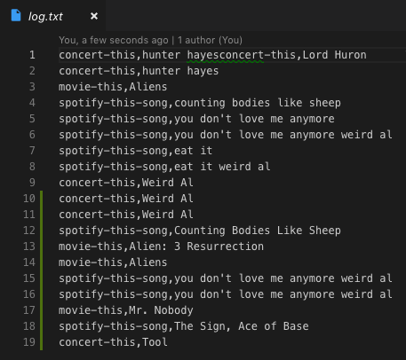

# liri
Week 10 Homework - **"Hey, Liri!"**

## Why liri?
Liri is a great (if not obtuse?) alternative to your iOS ecosystem's so-called smart searching Siri.

### Instructions
You can employ the following commands so long as you prefix with "node liri ...", naturally:
* **concert-this <Your artist here!>**
This command uses the BandsInTown API to show you the venue, venue location, & date of your queried-artist's next concert!

* **spotify-this-song <Your song here!>**
This command employs the Spotify API to pull up a little info (& a link!) to your searched-for song. If you don't get the song you're looking for, perhaps try adding the artist's name to your search!

* **movie-this** **<Your movie here!>**
This command utilizes the Internet's favorite movie API, omdbAPI. Try your favorite movie for some fun snippets of info!

* **do-what-it-says**
This command is a curve ball! It pulls information (courtesty of "fs") from the random.txt file and runs the info. Be prepared for trickery!

As an added bonus the note the log.txt file logs all queries.

## Please see examples of the CLI App in Action:

